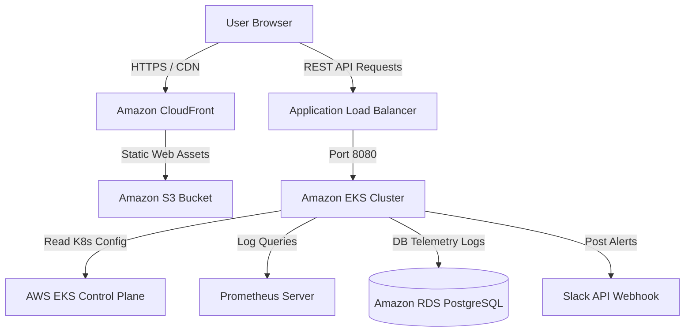

# Production Deployment Guide: NEBULA-TWIN

This guide outlines the end-to-end steps to deploy the **Nebula-Twin** Cloud Digital Twin platform (Frontend, Spring Boot Backend, and PostgreSQL database) to production on AWS (Amazon Web Services).

---

## Architecture Overview



---

## Phase 1: Database Deployment (Amazon RDS PostgreSQL)

### 1. Provision RDS instance
1. Navigate to the AWS Console &rarr; **RDS** &rarr; **Create Database**.
2. Choose **PostgreSQL** (version `15.x` or `16.x`).
3. Select the **Production** template (Multi-AZ deployment for high availability).
4. Set DB instance identifier to `nebula-twin-prod-db`.
5. Configure Master username to `postgres` and set a secure password.
6. Under **Connectivity**:
   - Associate with your VPC.
   - Choose a Private Subnet.
   - Create a security group allowing ingress on port `5432` only from the EKS security group.
7. Click **Create Database**.

### 2. Initialize Database Schema
Run the schema setup commands to configure the custom credentials and public schema access used by the Spring Boot backend:

```bash
# Connect to your RDS instance from a bastion host in the VPC
psql -h nebula-twin-prod-db.xxxx.us-east-1.rds.amazonaws.com -U postgres -d postgres

# Run database creation commands
CREATE DATABASE nebulatwindb;
CREATE USER dbadmin WITH PASSWORD 'YourHighlySecureProdPass123!';
ALTER DATABASE nebulatwindb OWNER TO dbadmin;

# Connect to the new database and grant schema privileges
\c nebulatwindb
GRANT ALL ON SCHEMA public TO dbadmin;
```

---

## Phase 2: Spring Boot Backend Deployment (Amazon EKS)

### 1. Build and Package Backend
Package the Spring Boot application into a production-ready fat JAR file:

```bash
cd backend
mvn clean package -DskipTests
```
This builds `target/backend-0.0.1-SNAPSHOT.jar`.

### 2. Containerize using Docker
Create a `Dockerfile` in the `backend/` directory:

```dockerfile
FROM openjdk:17-jdk-slim
WORKDIR /app
COPY target/backend-0.0.1-SNAPSHOT.jar app.jar
EXPOSE 8080
ENTRYPOINT ["java", "-jar", "app.jar"]
```

Build the container image:
```bash
docker build -t nebula-twin-backend:latest .
```

### 3. Push Image to Amazon ECR
1. Create a repository in **Amazon ECR**:
   ```bash
   aws ecr create-repository --repository-name nebula-twin-backend --region us-east-1
   ```
2. Log in your local Docker client to AWS ECR:
   ```bash
   aws ecr get-login-password --region us-east-1 | docker login --username AWS --password-stdin <AWS_ACCOUNT_ID>.dkr.ecr.us-east-1.amazonaws.com
   ```
3. Tag and push the image:
   ```bash
   docker tag nebula-twin-backend:latest <AWS_ACCOUNT_ID>.dkr.ecr.us-east-1.amazonaws.com/nebula-twin-backend:latest
   docker push <AWS_ACCOUNT_ID>.dkr.ecr.us-east-1.amazonaws.com/nebula-twin-backend:latest
   ```

### 4. Create Kubernetes Manifests
Create a deployment manifest `k8s-backend.yaml`:

```yaml
apiVersion: apps/v1
kind: Deployment
metadata:
  name: nebula-twin-backend
  namespace: production
  labels:
    app: nebula-twin-backend
spec:
  replicas: 2
  selector:
    matchLabels:
      app: nebula-twin-backend
  template:
    metadata:
      labels:
        app: nebula-twin-backend
    spec:
      containers:
      - name: backend
        image: <AWS_ACCOUNT_ID>.dkr.ecr.us-east-1.amazonaws.com/nebula-twin-backend:latest
        ports:
        - containerPort: 8080
        env:
        - name: SPRING_DATASOURCE_URL
          value: "jdbc:postgresql://nebula-twin-prod-db.xxxx.us-east-1.rds.amazonaws.com:5432/nebulatwindb"
        - name: SPRING_DATASOURCE_USERNAME
          value: "dbadmin"
        - name: SPRING_DATASOURCE_PASSWORD
          value: "YourHighlySecureProdPass123!"
        - name: KUBERNETES_CLIENT_IN_CLUSTER
          value: "true"
        resources:
          limits:
            cpu: "1000m"
            memory: "512Mi"
          requests:
            cpu: "250m"
            memory: "256Mi"
---
apiVersion: v1
kind: Service
metadata:
  name: nebula-twin-backend-svc
  namespace: production
spec:
  type: ClusterIP
  ports:
  - port: 8080
    targetPort: 8080
  selector:
    app: nebula-twin-backend
```

Apply the deployment:
```bash
kubectl apply -f k8s-backend.yaml
```

---

## Phase 3: Frontend Deployment (Amazon S3 + CloudFront)

The frontend is a lightweight, high-performance static glassmorphic dashboard. It is best deployed on a global CDN to provide maximum visual speed.

### 1. Create S3 Bucket
1. Navigate to **Amazon S3** &rarr; **Create Bucket**.
2. Set Bucket name to `nebula-twin-frontend-prod`.
3. Disable "Block all public access" (or keep it private and use CloudFront OAI/OAC to fetch assets).

### 2. Copy Static Web Assets
Upload the HTML, CSS, JS, and local library files directly to S3:

```bash
# Sync local files to the S3 bucket
aws s3 sync . s3://nebula-twin-frontend-prod --exclude "backend/*" --exclude ".git/*" --exclude "node_modules/*" --exclude "package-lock.json"
```

### 3. Set Up CloudFront CDN
1. Create a CloudFront **Distribution**.
2. Set **Origin Domain** to your S3 bucket endpoint.
3. Configure **Origin Access Control (OAC)** to ensure S3 only allows access from CloudFront (highly secure).
4. Set default root object to `index.html`.
5. Associate an SSL/TLS Certificate using AWS Certificate Manager (ACM) to enable HTTPS.
6. Deploy the distribution. The CDN will provide a fast URL (e.g. `https://dxxxxx.cloudfront.net`).

---

## Phase 4: CI/CD Pipeline Integration (Jenkins / GitHub Actions)

To automate deployments when pushing changes:

```yaml
# Sample GitHub Actions deployment workflow: .github/workflows/deploy.yml
name: Deploy Nebula-Twin
on:
  push:
    branches:
      - main

jobs:
  build-and-deploy:
    runs-on: ubuntu-latest
    steps:
    - name: Checkout Source Code
      uses: actions/checkout@v3

    - name: Set up JDK 17
      uses: actions/setup-java@v3
      with:
        java-version: '17'
        distribution: 'temurin'

    - name: Build Spring Boot Backend
      run: |
        cd backend
        mvn clean package -DskipTests

    - name: Configure AWS Credentials
      uses: aws-actions/configure-aws-credentials@v1
      with:
        aws-access-key-id: ${{ secrets.AWS_ACCESS_KEY_ID }}
        aws-secret-access-key: ${{ secrets.AWS_SECRET_ACCESS_KEY }}
        aws-region: us-east-1

    - name: Login to Amazon ECR
      id: login-ecr
      uses: aws-actions/amazon-ecr-login@v1

    - name: Push Container to ECR
      run: |
        docker build -t ${{ steps.login-ecr.outputs.registry }}/nebula-twin-backend:${{ github.sha }} ./backend
        docker push ${{ steps.login-ecr.outputs.registry }}/nebula-twin-backend:${{ github.sha }}

    - name: Update EKS Deployment
      run: |
        aws eks update-kubeconfig --name nebula-twin-eks-cluster --region us-east-1
        kubectl set image deployment/nebula-twin-backend backend=${{ steps.login-ecr.outputs.registry }}/nebula-twin-backend:${{ github.sha }} -n production

    - name: Sync Static Assets to S3 & Invalidate CDN
      run: |
        aws s3 sync . s3://nebula-twin-frontend-prod --exclude "backend/*" --exclude ".git/*" --exclude "node_modules/*"
        aws cloudfront create-invalidation --distribution-id ${{ secrets.CLOUDFRONT_DIST_ID }} --paths "/*"

---

## ⚡ Alternative Deployment: Railway (Backend & DB) + Vercel (Frontend)

For quick, low-cost serverless hosting, you can deploy the database and Spring Boot backend to **Railway.app** and host the frontend dashboard on **Vercel.com**.

### Step 1: Deploy PostgreSQL Database on Railway
1. Sign up/log in to **[Railway.app](https://railway.app)**.
2. Click **New Project** &rarr; **Provision PostgreSQL**.
3. Once initialized, click on the **PostgreSQL** box, go to the **Variables** tab, and copy the DB connection parameters:
   - Host name (e.g. `viaduct.proxy.rlwy.net`)
   - Port (e.g. `5432` or custom)
   - Database Name (e.g. `railway`)
   - Username (e.g. `postgres`)
   - Password (provided by Railway)

### Step 2: Deploy Spring Boot Backend on Railway
1. Click **New** &rarr; **GitHub Repo** and connect your `NEBULA-TWIN` repository.
2. Click on the newly imported service box, go to **Settings**:
   - Set **Root Directory** to `backend`.
3. Go to the **Variables** tab and add the environment variables that map your Railway database parameters to Spring Boot configurations:
   - `SPRING_DATASOURCE_URL` = `jdbc:postgresql://<YOUR_RAILWAY_DB_HOST>:<PORT>/railway`
   - `SPRING_DATASOURCE_USERNAME` = `postgres`
   - `SPRING_DATASOURCE_PASSWORD` = `<YOUR_RAILWAY_DB_PASSWORD>`
   - `SLACK_WEBHOOK_URL` = `https://hooks.slack.com/services/YOUR/WEBHOOK/URL`
4. Railway will automatically compile your Java Spring Boot application using Maven, configure table schemas via `schema.sql`, and deploy it.
5. In **Settings**, click **Generate Domain** to get your public REST API URL (e.g., `https://nebula-twin-backend-production.up.railway.app`).

### Step 3: Configure Frontend Target API
1. Open the [app.js](file:///d:/DEV/app.js) file.
2. Update the `API_BASE_URL` constant at the top of the file to point to your new public Railway backend domain:
   ```javascript
   const API_BASE_URL = window.location.hostname === 'localhost' || window.location.hostname === '127.0.0.1'
       ? "http://localhost:8080"
       : "https://nebula-twin-backend-production.up.railway.app"; // Replace with your Railway public URL
   ```
3. Commit and push the changes:
   ```bash
   git add app.js
   git commit -m "config: set production API endpoint target to Railway app"
   git push origin main
   ```

### Step 4: Deploy Frontend on Vercel
1. Log in to **[Vercel.com](https://vercel.com)**.
2. Click **Add New** &rarr; **Project**.
3. Import your `NEBULA-TWIN` repository from GitHub.
4. Set **Framework Preset** to **Other** (since this is a pure HTML/CSS/JS frontend).
5. Leave the root directory as `./` (Vercel will deploy using the `index.html` and `vercel.json` configurations in the root directory).
6. Click **Deploy**. Vercel will build and launch your dashboard globally!

